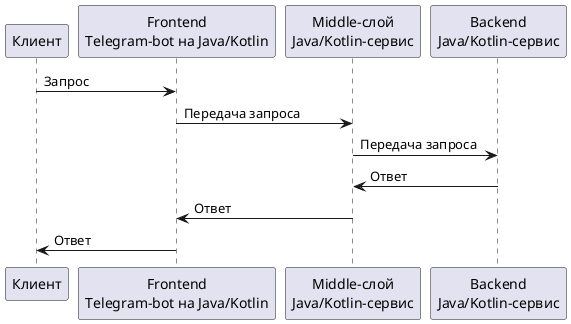

<div style="text-align: center" align="center">
    <a href="https://gpb.fut.ru/itfactory/backend"></a>
    <h1>Telegram Чат-бот "МиниБанк"</h1>
    <p>Проект, разработан в рамках академической программы <a href="https://gpb.fut.ru/itfactory/backend">GPB IT FACTORY 2024</a>,
представляет собой практическое приложение на Java,
демонстрирующее систему "МиниБанк". Он состоит из трех основных компонентов:
фронтенд в виде Telegram-бота, миддлваре-сервис на Java и бэкенд-сервис на Java.
Проект создан с учетом современных мировых стандартов и включает в себя Java 21,
Spring Boot, PostgreSQL, Docker и Kubernetes.</p>
</div>
<br>

## 📝 Содержание

- [Предварительные требования](#-предварительные-требования)
- [Запуск бота](#-запуск-бота)
- [Установка](#-установка)
- [Использование](#-использование)
- [Тестирование](#-тестирование)
- [Документация](#-документация)
- [Контакты](#-контакты)

## 📢 Предварительные требования
Для запуска проекта Вам необходимо установить следующий компоненты:

1. [Java 21](https://www.oracle.com/java/technologies/downloads/)
2. [Docker](https://docs.docker.com/engine/install/)

## 🚀 Запуск бота
Для удобства запуск бота предусмотрен в
[Docker контейнере](https://www.geeksforgeeks.org/docker-compose-for-java-applications-simplifying-deployment/),
запускаемом [Docker-compose](https://docs.docker.com/compose/) приложением.

1. Клонируйте проект ```git clone https://github.com/gpb-it-factory/semkin-telegram-bot.git```
2. Войдите в директорию с проектом cd /путь/к/проекту/
3. Разрешите выполнение скриптов
   ```sudo chmod +x start-bot.sh && chmod +x stop-bot.sh ```
4. Создайте в директории /Docker файл telegram-bot.env.
5. Добавьте в файл telegram-bot.env переменную TELEGRAM_GPB_BOT_TOKEN: ТОКЕН-БОТА. 
4. Выполните скрипт ```./start-bot.sh``` для запуска бота.
5. Выполните скрипт ```./stop-bot.sh``` для остановки бота.

Адрес бота: https://t.me/gpb_factory_bot

Имя бота: _GPB IT Factory Backend 2024_

## 📲 Диаграмма

<details>
<summary>Смотреть</summary>



</details>

### 🔧 Установка

⚠️ _Раздел в разработке._

Шаги по установке проекта:

````bash
git clone https://yourrepository.git
cd your-project-folder
docker-compose up --build
````

## 🎯 Использование

⚠️ _Раздел в разработке._

Примеры того, как использовать проект. Например, как взаимодействовать с ботом через Telegram.

## 🔍 Тестирование

⚠️ _Раздел в разработке._

Описание процесса тестирования проекта.

````cd backend
./gradlew test
````

## 📚 Документация

⚠️ _Раздел в разработке._

Ссылки на дополнительные ресурсы и документацию, если они есть.

## ☎️ Контакты

Если у вас есть вопросы или предложения, вы можете связаться со мной следующим образом:

- **Email:** <a href="mailto:vnsemkin@gmail.com">vnsemkin@gmail.com</a>
- **Telegram:** [@vnsemkin](https://t.me/vnsemkin)